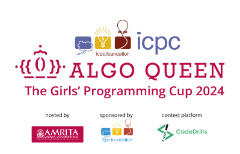

    

<h1>ICPC - International Collegiate Programming Contest</h1>

    

### Coach: Mr. Ramaguru Radhakrishnan, Assistant Professor (Sr. Gr.) - [ICPC Profile](https://icpc.global/ICPCID/JPS1ASBHGWC6)

## ICPC 2023-2024 

#### [The 2023 ICPC Asia Amritapuri Doublesite Regional Contest - Amritapuri](https://icpc.codedrills.io/contests/icpc-amritapuri-2023-regional-round/)  
-  28 Jan 2024, Sun 9:00 - 14:00 (5 Hours)
-  TP: 228 and TS: 2766

#### [ICPC India Preliminary 2023](https://codedrills.io/contests/icpc-india-preliminary-2023)   
-  26 Nov 2023, Sun 11:00 - 13:00 (2 Hours)
-  TP: 3368 and TS: 9735

| S. No. | Team Name | Team Members | Practice  | Prelims | Regionals | 
|:------:|:---------:|:------------:|:--------:|:----------:|:-------:|
| 1 | Hamswenee | [Avi Nair](https://icpc.global/ICPCID/VYWZFNBQ69SX)   [Joshua Anto A]()   [Ramraj S](https://icpc.global/ICPCID/5OEWCXMRIZVJ) | 404 | 1177 | 181 |
| 2 | Ethereal Equations | [Amal Ritessh A P](https://icpc.global/ICPCID/NVHNR6RDKTJC)   [Mukesh R](https://icpc.global/ICPCID/20IT96VKKNPE)   [Sree Sharvesh S S](https://icpc.global/ICPCID/GO9AI1TEQ2PA) | 9 | 1405 | NA |
| 3 | Br0s_C0d3_;-) | [Rushyendra Burla](https://icpc.global/ICPCID/ELA9MDO38EQP)   [Mohana Vamsi Sowdepally](https://icpc.global/ICPCID/X2GWUDTE3TVB)   [Arul Sujith S](https://icpc.global/ICPCID/IXRTFRBHTL32) | 577 | 1399 | NA | 

    

## AlgoQueen 2024 

| S.No | Name | Practice 1 - Position | Practice 2 - Position | Practice 3 - Position | Prelims | 
|:----:|:-----:|:--------:|:--------:|:----------:|:--------------:|
|  1   | Adithya N S | 99  | 146 | 232 | 801 |
|  2   | Aishwarya S | 64  | 185 | 283 | 590 |
|  3   | C S Amritha |  86 | NP | NP | 977 | 
|  4   | Dharshika S | NP  | 310 | 142 | 574 | 
|  5   | G Hamsini   | NP | 340 | 112 | 735 | 
|  6   | R Sruthi    | 49 | NP | 127 | 829 | 
|  7   | Shree Harini T | 41 | NP | 224 | 752 |
|  8   | Parvathi S | NP  | NP | 185 | 537 |
|  9   | Amita Narayanan Kutty | NP | 197 | NP | 458 | 

